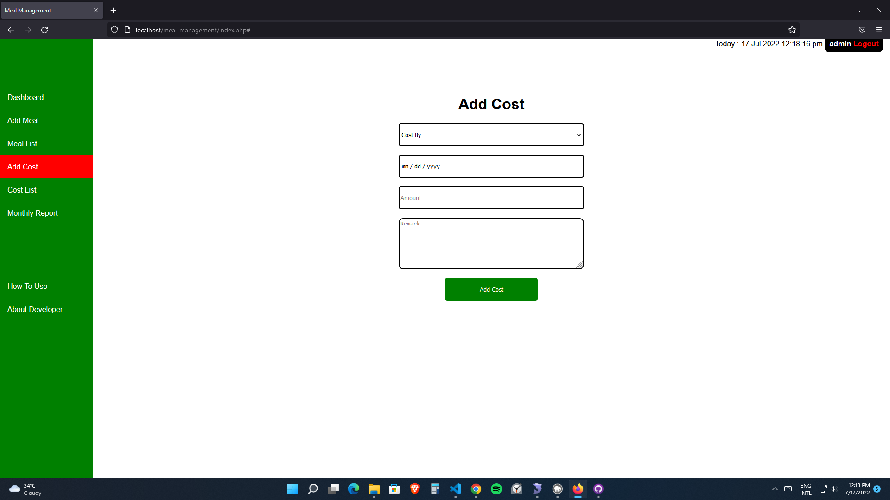

<h1>Meal Management System</h1>

1) Download or clone the project and place it inside htdocs/www depending on(xampp/mamp/wamp)
2) Download database .sql file and create a database called "meal_management" and import the database
3) Edit connection.php file and add necessary database details
4) Type "localhost/meal_management" in your browser

I am still working on Monthly Report and Edit meal and cost system. Stay tuned!